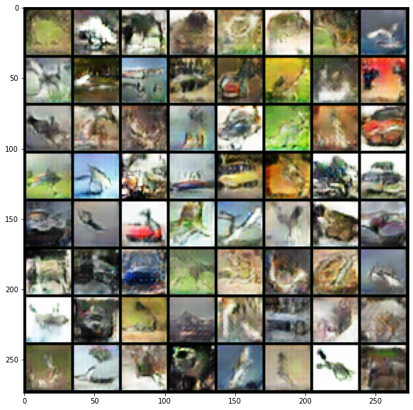
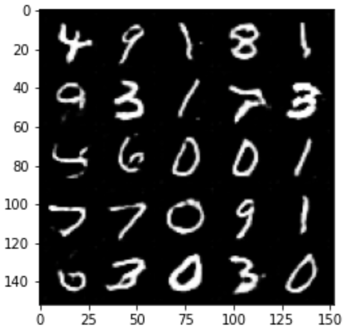

## Condtional DGAN

This is an implementation based on the paper <a href="https://arxiv.org/pdf/1511.06434.pdf">UNSUPERVISED REPRESENTATION LEARNING WITH DEEP CONVOLUTIONAL GENERATIVE ADVERSARIAL NETWORKS</a> 

A Generative Adversarial networks that generate an image based on a given label.

 

### Result after training 10 epochs on MNIST and 30 epochs on CIFAR.

 

